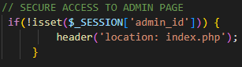

# Quai Antique 

## _Présentation du projet_

:man_cook: Le Chef Arnaud Michant aime passionnément les produits - et producteurs - de la Savoie. C’est pourquoi il a décidé d’ouvrir son troisième restaurant dans ce département.
Le Quai Antique sera installé à Chambéry et proposera au déjeuner comme au dîner une expérience gastronomique, à travers une cuisine sans artifice.
Plus encore que ses deux autres restaurants, Arnaud Michant le voit comme une promesse d’un voyage dans son univers culinaire.
Lors de l’inauguration de son deuxième établissement, le chef Michant a pu constater l’impact positif que pouvait avoir un bon site web sur son chiffre d’affaires. 
C’est pourquoi il a fait appel à l’agence web dont vous faites partie.

>Dans le cadre de cette mission qui vous est affectée, vous aurez à créer une application web vitrine pour le Quai Antique avec ce goût de la qualité que recherche Arnaud Michant.


### Lien de la version en ligne du projet

    https://quai-antique-site-restaurant.herokuapp.com/

### Lien vers le GitHub du projet

    https://github.com/EdouardBurel/quai_antique.git

### Lien vers le logiciel de gestion de projet

    https://github.com/users/EdouardBurel/projects/1

### Documentation ###

>  L'ensemble de la documentation se trouve dans le dossier "documentation" à la racine du projet, comprenant:
- documentation technique
- charte graphique
- Script SQL (fichier format .txt)

## Spécifications techniques

- HTML 5
- CSS 3
- JavaScript
- Unsplash
- PHP 8.1.10
- phpMyAdmin
- Bootstrap
- Heroku (déploiement)

## Installation en local

Introduire le code ci-dessous sur un terminal de commandes :

```sh
git clone https://github.com/EdouardBurel/quai_antique.git
```

### Création et alimentation de la base de données

> La création et alimentation de la BDD a été effectué manuelement (script SQL). Vous trouverez ce script dans le fichier "SQL.txt",situé dans le dossier “Documentation”.

### Accéder à l’administration / Sécurité

> L’accès au panel d’administration est sécurisé et ne peut être accessible que si un compte admin existe.



>Voici les identifiants admin pour accéder au panel d'amnistration:
-  Sur la page /login.php, ajouter:
 email: admin@admin.com  
 mot de passe: admin1

### Gestion des utilisateurs

> Lorsqu'un utilisateur crée un compte sur la page /inscription.php, on lui proposera d’entrer une adresse email, un mot de passe sécurisé, un nombre de convives par défaut ainsi que la mention des allergies.
> Lorsque l'utilisateur se connecte et accède à la page pour réserver une table, son nom, le nombre de convives et les allergies sont remplis automatiquement avec les réglages du client sur le formulaire de réservation.

### Réserver une table
> L'accès à la page /book.php pour réserver une table n'est uniquement possible que lorsqu'un utilisateur (user_id) de la BDD est connecté. Par défaut, le lien vous redirigera vers la page de connexion.

### Définition des rôles

> L’administrateur dispose d'un panel d'administration pour gérer: 
- la galerie d'images de la page d'accueil (CRUD);
- l'horaire du restautant;
- gestion de la carte du restaurant;
- ajuster le nombre de convives maximum du restaurant.

> Le client connecté peut accéder à la page de réservation pour réserver une table.

### Page Menus

> Tout visiteur peut consulter le carte du restaurant sur la page dédiée /menu.php.
> Les plats sont listés dans des catégories comprenant les informations suivantes:
- une image
- un titre
- une descrption
- un prix
- une catégorie

> Le visiteur peut filtrer les plats en fonction de la catégorie.
> La page présente également une catégorie formule menu (midi ou soir).

### Compréhension et Structure d'arborescence logique
Le création de l'application se compose de plusieurs dossiers formant l'arborescence ci-dessous:
- Le <ins>dossier admin</ins> regroupe toutes les fonctionnalités pour le panel d'amnistration;
- Le <ins>dossier assets</ins> s'agit du CSS de l'application;
- Le <ins>dossier lib</ins>regroupe l'ensemble du codage reparti par section ;
- Le <ins>fichier index.php</ins> s'agit de la page principale.


### Fonctionnalités application

> <ins>Page d'accueil</ins>:
- Mise à dispotion d'un bouton flêche permettant de scroller vers la galerie.
- En survolant les photos de la galerie, le titre du plat s'affiche.
- En cliquant sur le bouton “Réserver une table”, le client est redirigé vers la page book s'il est connecté.
> <ins>Page Menus</ins>: 
- Une fonction dynamique est affichée pour filtrer les plats et menus sans rechargement de la page.

> <ins>Page Book (Réserver une table)</ins>:
- Le restaurant est limité en nombre de convives (seuil gérer par l'administrateur). Lorsque le client choisit sa date de réservation  et clique sur la confirmation de réservation, un message d'alerte s"affiche si le restautant est complet sur le jour selectionné.
